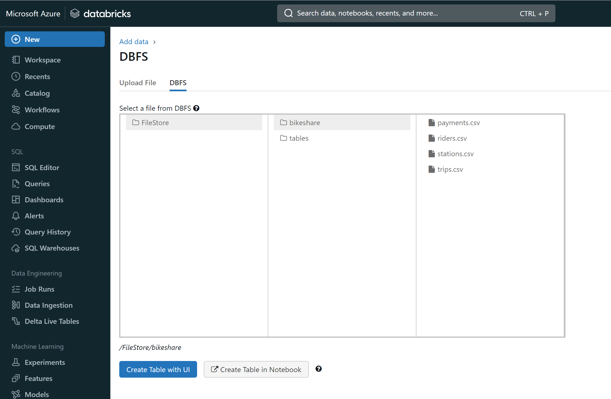
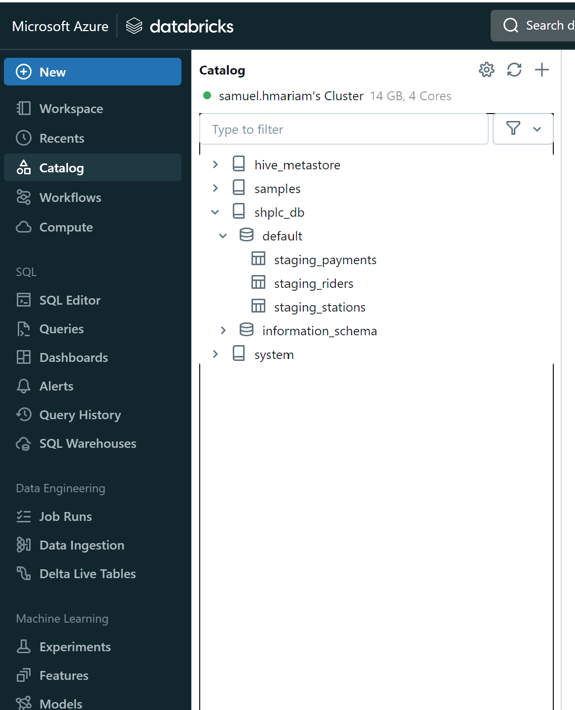

# Building an Azure Data Lakehouse for Bike Share on Azure Databricks

## Project Overview
Divvy is a bike sharing program in Chicago, Illinois USA that allows riders to purchase a pass at a kiosk or use a mobile application to unlock a bike at stations around the city and use the bike for a specified amount of time. The bikes can be returned to the same station or to another station. The City of Chicago makes the anonymized bike trip data publicly available for projects like this where we can analyze the data.

Since the data from Divvy are anonymous, we have created fake rider and account profiles along with fake payment data to go along with the data from Divvy. The dataset looks like this:

## The Goal 

The goal of this project is to develop a data lakehouse solution using Azure Databricks. The steps include the following: 

    - Import into DBFS;
    - Create delta files and staging tables
    - Design a star schema based on the business outcomes listed below;

        + Analyze how much time is spent per ride
        + Based on date and time factors such as day of week and time of day
        + Based on which station is the starting and / or ending station
        + Based on age of the rider at time of the ride
        + Based on whether the rider is a member or a casual rider
        + Analyze how much money is spent
        + Per month, quarter, year
        + Per member, based on the age of the rider at account start

### Steps To Reproduce The project

1. Create Infrastructure Resources

    - Create Azure Databricks Workspace
   
2. Load Data onto DBFS

    - Import the local CSV files onto the DBFS using the following Jupyter notebook:

      `extract-data.ipynb`

      

3. Create Staging Tables

    - Create staging tables using the following Jupyter notebook:
    
      `load-data.ipynb`

      

4. Data Modeling

    - Create the dimension and fact tables using the following Jupyter notebook:

       `transform-data.ipynb`

      
    
    - The dimension and fact tables created are inline with the following star schema
    
      

